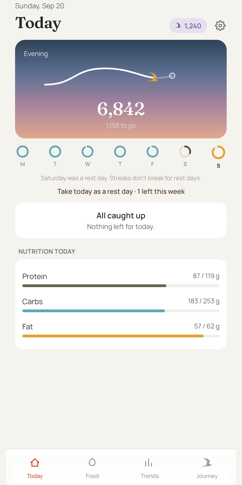
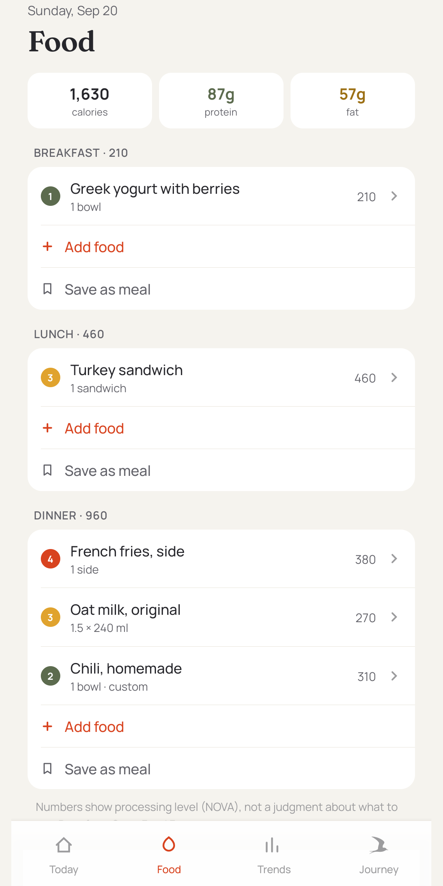
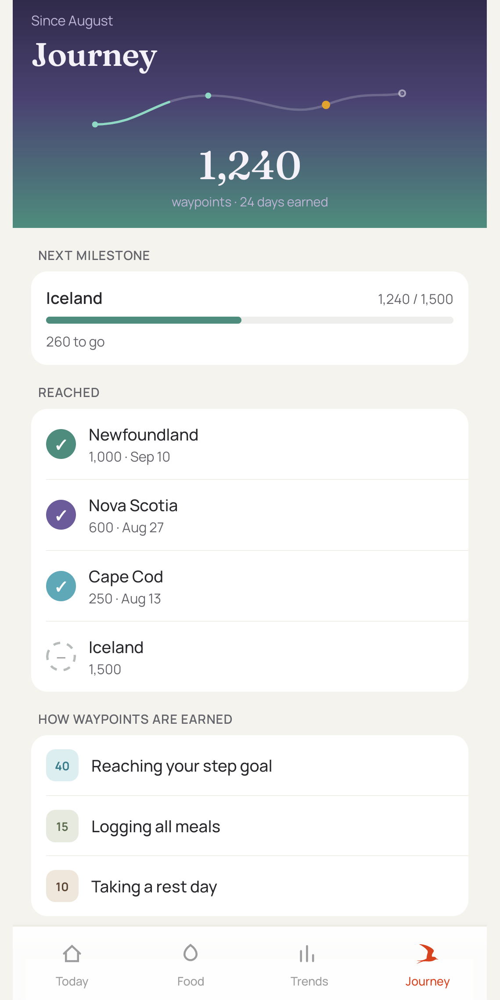
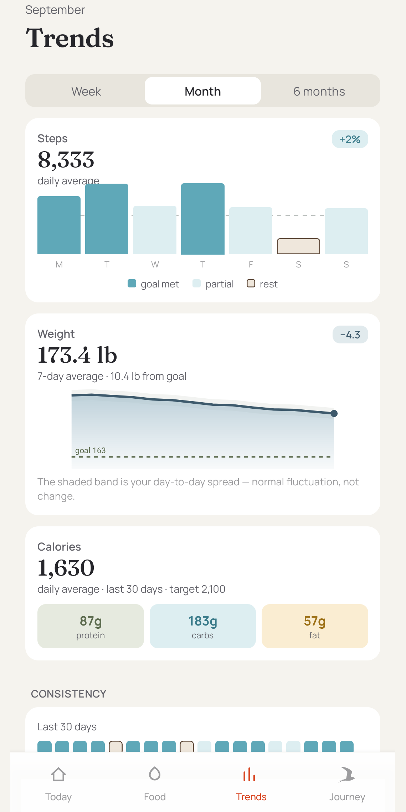

# Tern

**Move, eat, rest. A kinder tracker for the life you're actually living.**

[](https://github.com/a-thread/tern/actions/workflows/ci.yml)


Tern is a health tracker for steps, food, weight, water and mood, inspired by the Arctic
tern, the bird with the longest regular migration on Earth. Each day you show up, your
tern travels a little further along its journey.

Waypoints are earned for things within reach: meeting your step goal, logging your meals,
taking a rest day. **Weight and calories never earn or lose anything.** They're there to
inform you, with no verdict attached.

|  |  |  |  |
| :-------------------------------------: | :------------------------------------: | :------------------------------------------: | :----------------------------------------: |
|                **Today**                |                **Food**                |                 **Journey**                  |                 **Trends**                 |

## Features

- **Rewards for behavior only.** Waypoints are milestones on a map. Reach the Weddell Sea
  and your tern turns north for home, then sets off again, so the journey never runs out.
- **Rest counts.** A rest day counts as showing up and the streak carries through it.
- **Optional numbers.** Hide calories, turn off "remaining today", turn weight off.
  Nothing warns you for going over, and exercise never earns food back.
- **Food without a verdict.** Search everyday foods (USDA) and packaged products (Open
  Food Facts), scan barcodes, save meals, or re-log yesterday's dinner in a tap.
- **Steps from Health Connect.** Read on the device and never uploaded.
- **Your data is yours.** No ads, nothing sold. Export everything as JSON, or delete your
  data or account from Settings. A guest preview works without an account.

## Tech stack

| Layer      | Choice                                                                   |
| ---------- | ------------------------------------------------------------------------ |
| App        | [Expo](https://expo.dev) SDK 54, React Native 0.81, React 19, TypeScript |
| Navigation | React Navigation 7 (bottom tabs + native stack)                          |
| Backend    | [Supabase](https://supabase.com) (Postgres, auth, row-level security)    |
| Steps      | Android Health Connect via `react-native-health-connect`                 |
| Food data  | Open Food Facts, USDA FoodData Central                                   |
| Tests      | Jest, `jest-expo`, React Native Testing Library                          |
| Builds     | EAS Build, triggered from GitHub Actions                                 |

With no Supabase keys the app runs against an in-memory backend seeded with sample data,
so you can work on the UI without setting anything up.

## Getting started

**Prerequisites:** Node (the version in [.node-version](.node-version)), and either the
[Expo Go](https://expo.dev/go) app or an Android emulator.

```bash
git clone https://github.com/a-thread/tern.git
cd tern
npm install
cp .env.example .env   # optional, see Configuration
npx expo start
```

Scan the QR code with Expo Go, or press `a` to open an Android emulator.

Health Connect steps need a development client instead of Expo Go. See
[docs/health-connect.md](docs/health-connect.md).

## Configuration

Copy [.env.example](.env.example) to `.env` (gitignored). Every variable is optional.

| Variable                        | Purpose                                                            |
| ------------------------------- | ------------------------------------------------------------------ |
| `EXPO_PUBLIC_SUPABASE_URL`      | Supabase project URL. Blank runs on local sample data.             |
| `EXPO_PUBLIC_SUPABASE_ANON_KEY` | Supabase anon key. Safe to ship, since RLS protects the data.      |
| `EXPO_PUBLIC_HEALTH_CONNECT`    | Set to `1` in a dev build with Health Connect installed.           |
| `EXPO_PUBLIC_USDA_API_KEY`      | Enables everyday-food search. Blank falls back to Open Food Facts. |

To run against your own backend, follow [supabase/README.md](supabase/README.md) to create
a project and apply the migrations in [supabase/migrations/](supabase/migrations).

## Scripts

| Command              | What it does                   |
| -------------------- | ------------------------------ |
| `npm start`          | Start the Expo dev server      |
| `npm run android`    | Start and open on Android      |
| `npm run typecheck`  | Type-check with `tsc --noEmit` |
| `npm run lint`       | Lint with ESLint               |
| `npm test`           | Run the Jest suite             |
| `npm run test:watch` | Run Jest in watch mode         |

## Project layout

One folder per domain under [src/](src). Each follows the same layout: pure rules in
`models/`, state in a `*Context.tsx`, all I/O in `data/`, and its UI in
`screens/` and `components/`. The rules are in
[docs/architecture.md](docs/architecture.md#feature-layout).

```text
App.tsx          fonts, providers, navigation
src/
  shared/        theme tokens, UI components, charts, navigation, auth, backend context
  today/         the Today tab, steps, rest days
  food/          the Food tab, add-food flow, saved meals, search
  journey/       the waypoints ledger, map, milestones
  trends/        steps, weight, water and mood over time
  weight/ water/ mood/ medication/ settings/
supabase/        migrations and setup
docs/            architecture, design, release notes, hosted store pages
```

The full tour is in [docs/architecture.md](docs/architecture.md).

## Continuous integration

Workflows live in [.github/workflows/](.github/workflows).

- **[CI](.github/workflows/ci.yml)** runs typecheck, lint and tests on every pull request
  and on pushes to `main`.
- **[Build](.github/workflows/build.yml)** runs CI, then starts an EAS build. Push a
  `v*` tag for a production build, or run it manually from the Actions tab for an
  installable `preview` APK.

Release steps and required secrets are in [docs/RELEASING.md](docs/RELEASING.md).

## Contributing

Issues and pull requests are welcome.

1. Fork the repo and create a branch from `main`.
2. Make your change, with tests where the logic is pure (`models/` is the usual place).
3. Run `npm run typecheck && npm run lint && npm test`. CI runs the same three.
4. Open a pull request describing what changed and why.

Before touching anything the user sees, read [docs/design.md](docs/design.md). It sets the
palette rule and the earning rules, and the central one is that **waypoints reward
behavior, never weight or calorie totals**.

## Documentation

| Document                                         | What's in it                                              |
| ------------------------------------------------ | --------------------------------------------------------- |
| [docs/](docs/README.md)                          | the index, and the pages hosted for the store listing     |
| [docs/architecture.md](docs/architecture.md)     | folder layout, repositories, the waypoints ledger, schema |
| [docs/design.md](docs/design.md)                 | the palette rule, design commitments, earning rules       |
| [docs/health-connect.md](docs/health-connect.md) | turning on Android steps, what's configured               |
| [docs/food-search.md](docs/food-search.md)       | Open Food Facts and USDA, caching, attribution            |
| [supabase/README.md](supabase/README.md)         | setting up a project, migrations, what each table holds   |
| [docs/RELEASING.md](docs/RELEASING.md)           | EAS builds, the GitHub workflow, submitting to Play       |

## Status

Android first. iOS builds aren't wired up yet, and HealthKit steps aren't implemented.
Tern is a tracking tool, not medical advice.
